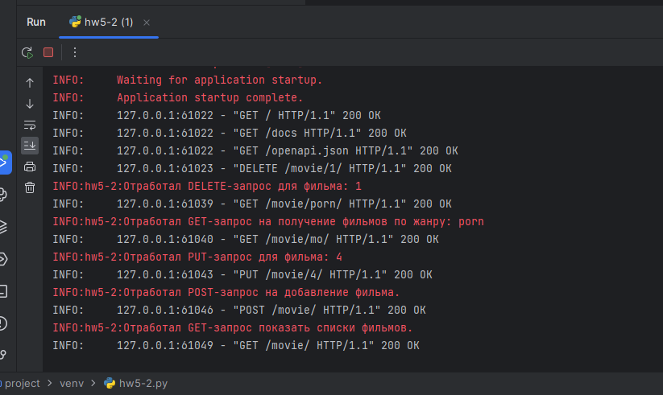

# Задание №2
Создать API для получения списка фильмов по жанру. 

Приложение должно

- иметь возможность получать список фильмов по заданному жанру.
- Создайте модуль приложения и настройте сервер и маршрутизацию.
- Создайте класс Movie с полями id, title, description и genre.
- Создайте список movies для хранения фильмов.
- Создайте маршрут для получения списка фильмов по жанру (метод GET).
- Реализуйте валидацию данных запроса и ответа.

# Результаты

[hw5-2](hw5-2.py)
