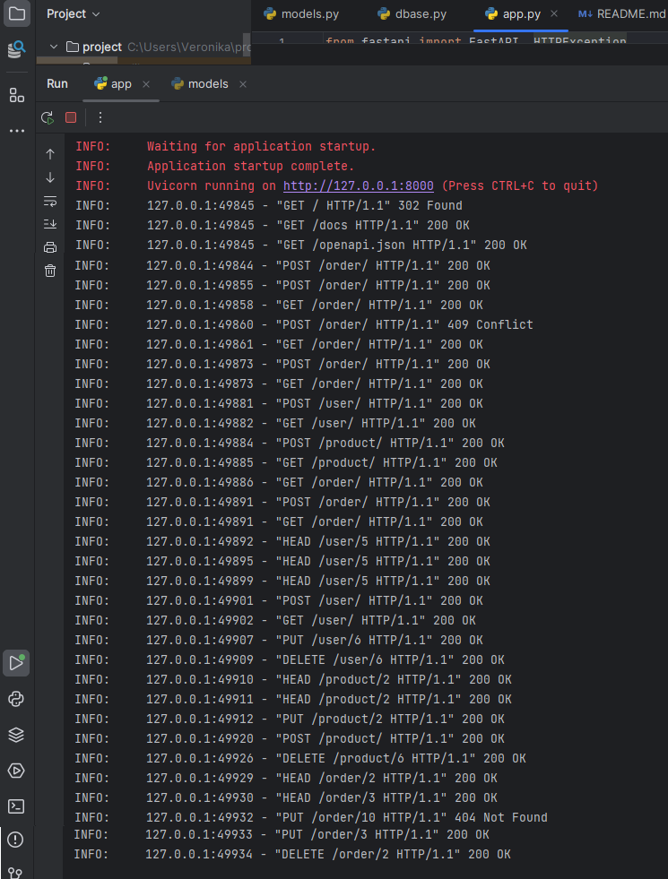

# Задание №6
Необходимо создать базу данных для интернет-магазина. 

База данных должна состоять из трех таблиц: товары, заказы и пользователи. [dbase.py](dbase.py)

- Таблица товары должна содержать информацию о доступных товарах, их описаниях и ценах.

- Таблица пользователи должна содержать информацию о зарегистрированных пользователях магазина.

- Таблица заказы должна содержать информацию о заказах, сделанных пользователями.

[пример](store_db.db)

Таблица пользователей должна содержать следующие поля: **_id (PRIMARY KEY), имя, фамилия, адрес электронной почты и пароль_**.

Таблица товаров должна содержать следующие поля: **_id (PRIMARY KEY), название, описание и цена._**

Таблица заказов должна содержать следующие поля: **_id (PRIMARY KEY), id пользователя (FOREIGN KEY), id товара (FOREIGN KEY), дата заказа и статус заказа._**

Создайте модели pydantic для получения новых данных и возврата существующих в БД для каждой из трёх таблиц (итого шесть моделей). [models](models.py)

Реализуйте CRUD операции для каждой из таблиц через создание маршрутов, REST API (итого 15 маршрутов). [app](app.py)

- Чтение всех
- Чтение одного
- Запись 
- Изменение
- Удаление

# Результат обработки запросов

