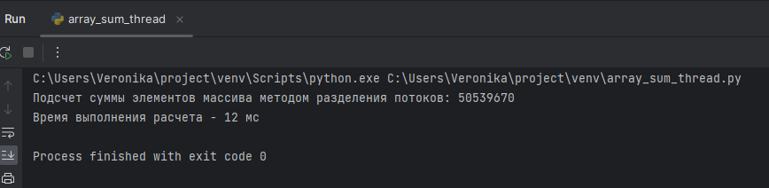
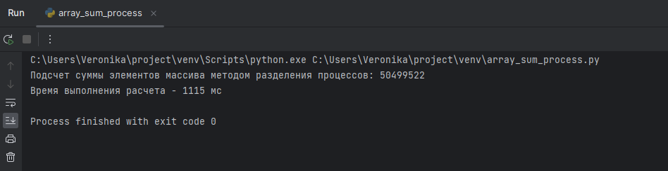
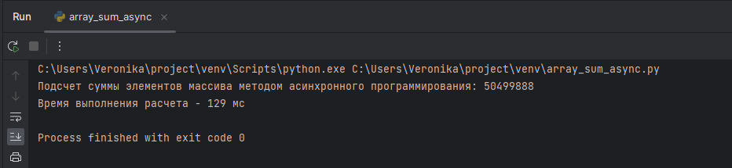
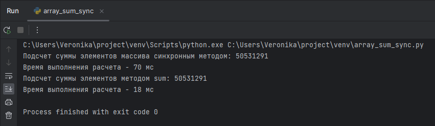
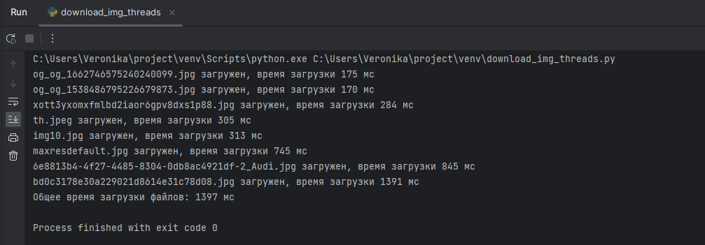
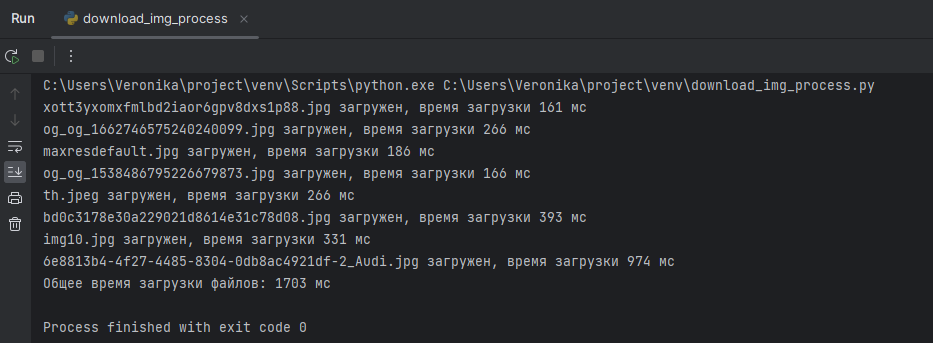
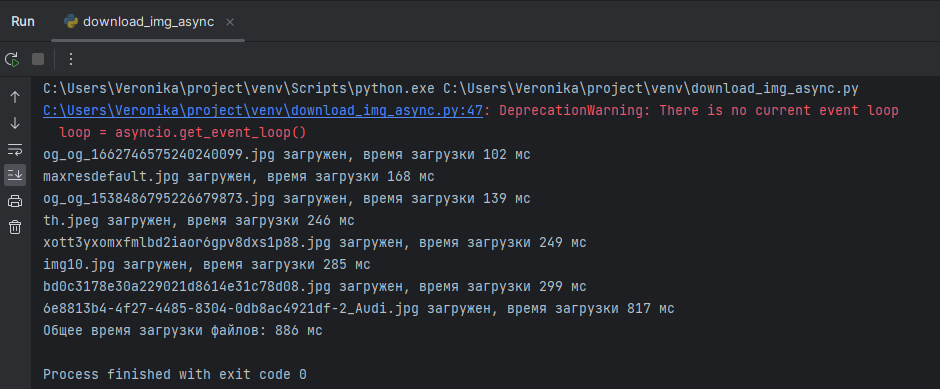
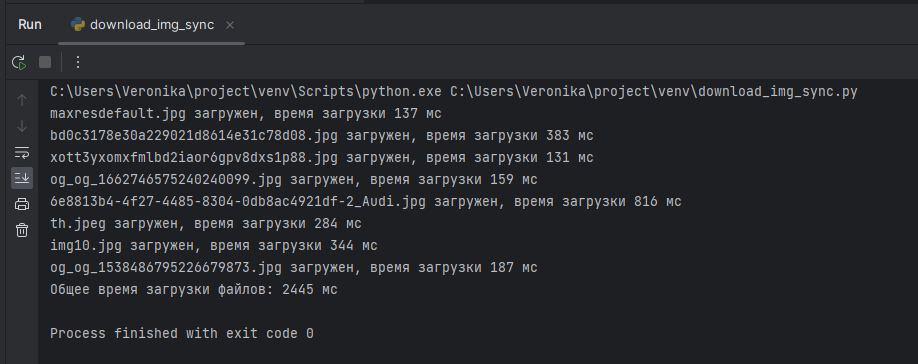

# HOMEWORK 4
## **Задание №7**

-  Напишите программу на Python, которая будет находить
сумму элементов массива из 1000000 целых чисел.

- Пример массива: arr = [1, 2, 3, 4, 5, 6, 7, 8, 9, 10, ...]

- Массив должен быть заполнен случайными целыми числами
от 1 до 100.

- При решении задачи нужно использовать многопоточность,
многопроцессорность и асинхронность.

- В каждом решении нужно вывести время выполнения
вычислений.

## Результаты

 - многопоточный вариант [здесь](array_sum_thread.py)

- многопроцессорный вариант [здесь](array_sum_process.py)

- вариант с асинхронностью [здесь](array_sum_async.py)

- проверка синхронного метода и встроенного метода sum  [здесь](array_sum_sync.py)

## Задание №9
-  Написать программу, которая скачивает изображения с заданных URL-адресов и
сохраняет их на диск. Каждое изображение должно сохраняться в отдельном
файле, название которого соответствует названию изображения в URL-адресе.
-  Например URL-адрес: https://example/images/image1.jpg -> файл на диске:
image1.jpg
-  Программа должна использовать многопоточный, многопроцессорный и
асинхронный подходы.
- Программа должна иметь возможность задавать список URL-адресов через
аргументы командной строки.
- Программа должна выводить в консоль информацию о времени скачивания
каждого изображения и общем времени выполнения программы.

## Результаты

 - многопоточный вариант [здесь](download_img_threads.py)

- многопроцессорный вариант [здесь](download_img_process.py)

- вариант с асинхронностью [здесь](download_img_async.py)

- проверка синхронного метода  [здесь](download_img_sync.py)

